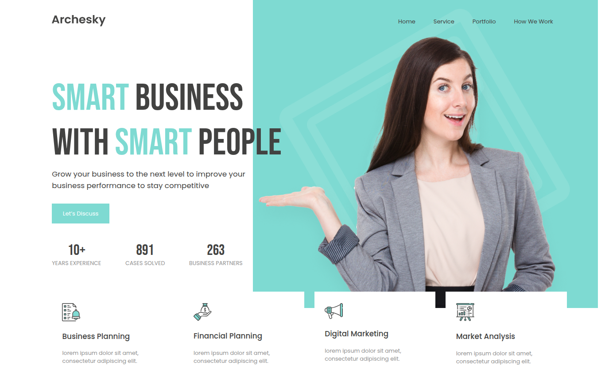

# 🚀 ARCHESKY
Landing page desarrollada con **HTML5** y **CSS3** a partir de un diseño en Figma.

## 🖼️ Vista Previa
A continuación se muestra el resultado final de la landing page desarrollada durante este proyecto.

El objetivo fue reproducir con la mayor fidelidad posible un diseño original en Figma, aplicando buenas prácticas de maquetación, estructura semántica y organización de estilos mediante HTML y CSS.

## 📘 Descripción General

**Archesky** es una landing page desarrollada con **HTML5** y **CSS3**, creada con fines educativos y de práctica, a partir de un diseño original en Figma.

El objetivo principal de este proyecto fue fortalecer habilidades de maquetación web, transformando un diseño estático en una interfaz funcional y visualmente atractiva. Durante el desarrollo se trabajó en la construcción de una estructura HTML semántica, la organización de estilos mediante CSS y la reproducción fiel de la composición visual propuesta en el diseño original.

La página presenta una propuesta corporativa moderna, compuesta por una sección principal (Hero Section), estadísticas destacadas y una sección de servicios. Además, se aplicaron técnicas de posicionamiento, manejo de tipografías, Flexbox y organización de componentes visuales para lograr una experiencia clara y equilibrada.

Este proyecto forma parte de mi proceso de aprendizaje en desarrollo web y representa una práctica enfocada en mejorar la atención al detalle, la estructura del código y la capacidad de convertir diseños de interfaz en páginas web funcionales.

## 🎯 Objetivo del Proyecto

El propósito de **Archesky** fue poner en práctica los fundamentos del desarrollo Front-End mediante la reproducción de un diseño profesional creado en Figma.

A través de este proyecto busqué fortalecer mis conocimientos en **HTML5** y **CSS3**, enfocándome en la construcción de estructuras semánticas, la organización de estilos y la creación de interfaces visualmente atractivas y bien distribuidas.

Además de replicar el diseño original con la mayor fidelidad posible, el proyecto me permitió practicar conceptos esenciales como el uso de **Flexbox**, el posicionamiento de elementos, la gestión de tipografías, el manejo de imágenes y la aplicación de buenas prácticas de maquetación web.

Más que un simple ejercicio visual, Archesky representa una oportunidad para desarrollar habilidades que forman parte del trabajo cotidiano de un desarrollador Front-End: interpretar un diseño, transformarlo en código y construir una experiencia web clara, organizada y funcional.

## ✨ Características Principales

### Diseño moderno y profesional
Landing page con una estructura limpia y atractiva, inspirada en un diseño corporativo contemporáneo.

### Maquetación semántica con HTML5
Uso de etiquetas semánticas como header, nav, section, article, figure y figcaption para mejorar la organización y accesibilidad del contenido.

### Estilización mediante CSS3
Aplicación de estilos personalizados para tipografías, colores, espaciados y distribución visual de los elementos.

### Uso de Flexbox
Implementación de Flexbox para construir estructuras flexibles y alineaciones consistentes en diferentes secciones de la página.

### Hero Section destacada
Sección principal con llamada a la acción (Call to Action), texto de impacto e indicadores de experiencia y resultados.

### Tarjetas de servicios
Presentación visual de servicios mediante componentes organizados con iconos, títulos y descripciones.

### Composición visual con capas y posicionamiento
Uso de posicionamiento absoluto y elementos decorativos para generar profundidad y reforzar el diseño original de Figma.

### Tipografía personalizada
Integración de fuentes de Google Fonts (Bebas Neue y Poppins) para mejorar la identidad visual y la legibilidad.

### Optimización de imágenes
Uso de imágenes adaptadas para diferentes resoluciones mediante el atributo srcset.

## 🧩 Estructura del Proyecto

El proyecto está organizado de forma sencilla para separar el contenido, los estilos y los recursos gráficos utilizados en la interfaz. 
<code>
  Archesky/
  │
  ├── index.html
  │
  ├── css/
  │   └── style.css
  │
  ├── images/
  │   ├── logo_archesky.png
  │   ├── logo_archesky@2x.png
  │   ├── business_planning.svg
  │   ├── financial_planning.svg
  │   ├── digital_marketing.svg
  │   ├── market_analysis.svg
  │   ├── woman.png
  │   ├── rectangle.png
  │   └── rectangle-1.png
  │
  ├── assets/
  │   └── result.png
  │
  └── README.md
</code>

### Descripción de los archivos

### index.html
Contiene la estructura principal de la página y la organización semántica del contenido.

### css/style.css
Archivo encargado de la presentación visual, incluyendo colores, tipografías, espaciados, posicionamiento y distribución de los elementos.

### images/
Carpeta que almacena los recursos gráficos utilizados en la interfaz, como logotipos, iconos e imágenes decorativas.

### assets/preview.png
Captura de pantalla utilizada en el README para mostrar el resultado final del proyecto.

### README.md
Documento que describe el proyecto, sus objetivos, tecnologías utilizadas y principales aprendizajes.

## 🧠 Conceptos Aplicados

Durante el desarrollo de Archesky se pusieron en práctica diversos conceptos fundamentales del desarrollo Front-End, enfocados en la construcción de interfaces web modernas y bien estructuradas.

### HTML Semántico

Se utilizaron etiquetas semánticas para organizar el contenido de manera clara y significativa, mejorando la legibilidad del código y favoreciendo la accesibilidad.

Entre las etiquetas utilizadas se encuentran:

* **header**
* **nav**
* **section**
* **article**
* **figure**
* **figcaption**

### Estructuración de Interfaces

La página fue organizada en diferentes bloques funcionales, permitiendo separar claramente la navegación, el contenido principal, las estadísticas y la sección de servicios.

Esta división facilita el mantenimiento del código y mejora la comprensión de la estructura general del proyecto.

### Flexbox

Se implementó Flexbox para distribuir y alinear elementos de manera eficiente, especialmente en:

* Barra de navegación.
* Indicadores de experiencia y resultados.
* Tarjetas de servicios.

### Posicionamiento y Capas Visuales

Se utilizaron técnicas de posicionamiento mediante position: absolute y control de profundidad con z-index para crear elementos decorativos y reforzar la composición visual del diseño original.

Este enfoque permitió generar una sensación de profundidad y dinamismo en la sección principal de la página.

### Tipografía Web

Se integraron fuentes externas mediante Google Fonts, combinando:

* Bebas Neue para títulos y elementos destacados.
* Poppins para textos y contenido informativo.

Esta combinación aporta personalidad visual y mejora la legibilidad del contenido.

### Manejo de Imágenes

Se incorporaron imágenes e iconos para enriquecer la interfaz, incluyendo el uso del atributo srcset para servir diferentes resoluciones del logotipo según la densidad de píxeles del dispositivo.

### Organización de Estilos

Los estilos fueron centralizados en un archivo CSS independiente, manteniendo una separación clara entre la estructura del documento y su presentación visual.

Este enfoque favorece la reutilización, el mantenimiento y la escalabilidad del proyecto.

## 🎨 Tecnologías Utilizadas

Las siguientes tecnologías y recursos fueron utilizados durante el desarrollo de Archesky:

### HTML5

Lenguaje de marcado utilizado para construir la estructura de la página, organizando el contenido mediante etiquetas semánticas y buenas prácticas de maquetación.

### CSS3

Lenguaje de estilos empleado para definir la apariencia visual de la interfaz, incluyendo colores, tipografías, distribución de elementos, espaciados y efectos de composición.

### Flexbox

Módulo de CSS utilizado para la alineación y distribución de componentes dentro de la página, facilitando la construcción de diseños modernos y organizados.

### Google Fonts

Servicio utilizado para integrar tipografías externas:

* **Bebas Neue**
* **Poppins**

Estas fuentes aportan identidad visual y mejoran la legibilidad del contenido.

### Figma

Herramienta de diseño utilizada como referencia para la construcción de la interfaz.

El proyecto fue desarrollado a partir de un diseño previamente creado en Figma, buscando reproducir su estructura y apariencia con la mayor fidelidad posible.

### Visual Studio Code

Editor de código utilizado durante el desarrollo del proyecto para la creación y organización de los archivos HTML y CSS.

## 📚 Aprendizajes y Objetivos

El desarrollo de Archesky representó una oportunidad para fortalecer conocimientos fundamentales del desarrollo Front-End y comprender mejor el proceso de transformación de un diseño visual en una página web funcional.

### Aprendizajes

Durante la construcción del proyecto pude reforzar conceptos como:

* La importancia de utilizar una estructura HTML semántica para organizar correctamente el contenido.
* El uso de Flexbox para distribuir y alinear elementos de manera eficiente.
* La aplicación de estilos mediante CSS para construir interfaces visualmente atractivas y coherentes.
* El manejo de imágenes, tipografías y recursos gráficos dentro de una página web.
* El uso de posicionamiento y capas visuales para recrear diseños más dinámicos y profesionales.
* La organización del código para mantener una separación clara entre estructura y presentación.
* La interpretación de diseños creados en Figma y su posterior implementación mediante HTML y CSS.
  
### Objetivos Alcanzados

* Reproducir con fidelidad una interfaz diseñada previamente en Figma.
* Practicar buenas prácticas de maquetación web.
* Fortalecer habilidades en HTML5 y CSS3.
* Comprender mejor la construcción de componentes visuales reutilizables.
* Mejorar la capacidad de analizar un diseño y convertirlo en una solución funcional.
* Desarrollar una base sólida para futuros proyectos Front-End más complejos.

Este proyecto forma parte de mi proceso de aprendizaje continuo en desarrollo web y representa un paso importante en la construcción de habilidades relacionadas con el diseño y desarrollo de interfaces modernas.

## 🚀 Próximos Pasos

Aunque Archesky cumple con los objetivos planteados para esta etapa de aprendizaje, existen varias oportunidades de mejora que permitirían seguir fortaleciendo habilidades de desarrollo Front-End y acercar el proyecto a estándares profesionales.

### 📱 Implementar Responsive Design

Adaptar la interfaz para diferentes tamaños de pantalla mediante el uso de Media Queries, garantizando una experiencia adecuada en dispositivos móviles, tabletas y computadores.

## 🎨 Incorporar Variables CSS

Centralizar colores, tipografías y valores reutilizables mediante variables CSS para facilitar el mantenimiento y la escalabilidad del proyecto.

Ejemplo: 
<code>
:root { 
  --primary-color: #7edad2; 
  --text-color: #424241; 
  --secondary-color: #909090; 
}
</code>

## ✨ Agregar Interactividad Visual

Implementar efectos visuales mediante pseudoclases como :hover para mejorar la experiencia de usuario en botones, enlaces y elementos interactivos.

## ♿ Mejorar la Accesibilidad

Fortalecer aspectos relacionados con accesibilidad web, incluyendo descripciones más completas para imágenes, navegación más intuitiva y mejores prácticas de semántica HTML.

## 🧩 Optimizar la Organización del CSS

Reducir repeticiones, simplificar selectores y estructurar los estilos de manera más modular para facilitar futuras ampliaciones del proyecto.

## ⚡ Mejorar el Rendimiento

Optimizar imágenes y recursos gráficos para reducir tiempos de carga y mejorar la eficiencia general de la página.

## 🚀 Explorar Tecnologías Front-End Avanzadas

Utilizar este proyecto como base para aprender herramientas y tecnologías más avanzadas, tales como:

* **JavaScript.**
* **Sass.**
* **Bootstrap.**
* **React.**

Estas mejoras permitirán seguir desarrollando habilidades relacionadas con la construcción de interfaces modernas, accesibles y adaptables a diferentes entornos.

## 📫 Conecteme

Si buscas a alguien con mentalidad de crecimiento, base técnica fuerte y compromiso real con el aprendizaje y el trabajo bien hecho, este perfil es un buen punto de partida.

📨 lucurban@gmail.com  
 +57 304 352 8449 

Gracias por pasar por aquí ✨
